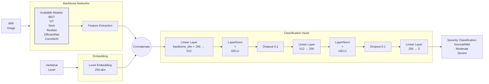

# RSNA Spinal Stenosis Prediction

## Introduction

This repository provides an end-to-end pipeline to classify spinal stenosis severity across different vertebral levels using a hybrid approach that integrates pre-trained vision models and dedicated vertebral level embeddings. The method leverages the feature extraction capabilities of pre-trained backbones while enriching them with spinal-level context, ultimately improving classification performance on the RSNA Spinal Stenosis dataset.

COmplete project report can be found here: `Spinal Canal Stenosis CAD.pdf`
## Methodology

### Backbone Models

We implemented six distinct pre-trained vision models as backbones:

- **Vision Transformer (ViT-B/16)** [1]
- **Swin Transformer (Swin-B)** [2]
- **BEiT** [3]
- **EfficientNet V2-M** [4]
- **ResNet-152** [5]
- **ConvNeXt Base** [6]

All models were pre-trained on ImageNet-1K. The original classification heads were removed, and their feature extraction layers were retained to produce feature vectors of dimensions ranging from 768 to 2048, depending on the backbone.

### Level Embeddings

To include vertebral level information, we introduced a dedicated embedding module:

- Maps each spinal level (L1/L2 through L5/S1) to a 256-dimensional embedding vector.
- Concatenates the level embedding with the backbone’s feature vector.
- The combined feature vector is passed through a Multi-Layer Perceptron (MLP) with the following structure:
  - **Input:** `[Backbone Features + 256-D Level Embedding]`
  - **MLP Architecture:** `512 → 256 → 3`
  - Each layer is followed by Layer Normalization, GELU activation, and a dropout layer for regularization.

### Training Configuration

- **Optimizer:** AdamW  
  - `learning_rate=1e-4`  
  - `weight_decay=0.02`
- **Batch Size:** 32
- **Number of Epochs:** 30
- **Loss Function:** Cross-Entropy Loss with class weights to address class imbalance.
- **Data Augmentation:**  
  - Random horizontal flips  
  - Random rotations  
  - Normalization using ImageNet statistics:  
    `mean=[0.485, 0.456, 0.406], std=[0.229, 0.224, 0.225]`
# Overview of the proposed spinal stenosis classification model architecture. The model combines pre-trained vision backbones with level-specific embeddings through a multi-layer classification head


### Transfer Learning Strategy

1. Initially freeze backbone weights to retain pre-trained knowledge.
2. Selectively unfreeze the last 32 layers for fine-tuning.
3. Fully train the level embedding module and classification head.

### Evaluation Metrics

Model performance is evaluated using the following metrics:

- Accuracy
- Precision
- Recall
- F1-Score

Confusion matrices are generated for each severity grade to provide detailed insights into model predictions. All evaluations are conducted on held-out validation and test sets to ensure unbiased assessments.

## Requirements

- Python 3.8+
- PyTorch
- torchvision
- transformers (Hugging Face)
- pandas
- argparse

Install the required dependencies via:

```bash
pip install torch torchvision transformers pandas
```

### Runining the experiment
## Clone the Repository

```bash
git clone https://github.com/Shijia1997/RSNA_spinal_stenosis_prediction.git
```

## Run Convolution-Based Models

```bash
python train_models.py \
    --models convnext efficientnet resnet152 \
    --batch_size 32 \
    --num_epochs 30 \
    --learning_rate 1e-4 \
    --weight_decay 0.02 \
    --level_embeddings 256 \
    --freeze_backbone True \
    --unfreeze_last_n 32
```

## Run Transformer-Based Models

```bash
python train_models.py \
    --models vit swin beit \
    --batch_size 32 \
    --num_epochs 30 \
    --learning_rate 1e-4 \
    --weight_decay 0.02 \
    --level_embeddings 256 \
    --freeze_backbone True \
    --unfreeze_last_n 32
```

## Results

After training, the following outputs will be generated:

- **Metrics and confusion matrices**: Saved in the `./results` directory.
- **Trained models**: Saved in the `./trained_models` directory.
- **Plots and visualizations**: Saved in the `./plots` directory.


## References

1. Dosovitskiy, A., et al. "An Image is Worth 16x16 Words: Transformers for Image Recognition at Scale." *ICLR*, 2021.  
2. Liu, Z., et al. "Swin Transformer: Hierarchical Vision Transformer using Shifted Windows." *ICCV*, 2021.  
3. Bao, H., et al. "BEiT: BERT Pre-Training of Image Transformers." *ICLR*, 2022.  
4. Tan, M., et al. "EfficientNetV2: Smaller Models and Faster Training." *ICML*, 2021.  
5. He, K., et al. "Deep Residual Learning for Image Recognition." *CVPR*, 2016.  
6. Liu, Z., et al. "A ConvNet for the 2020s." *CVPR*, 2022.
